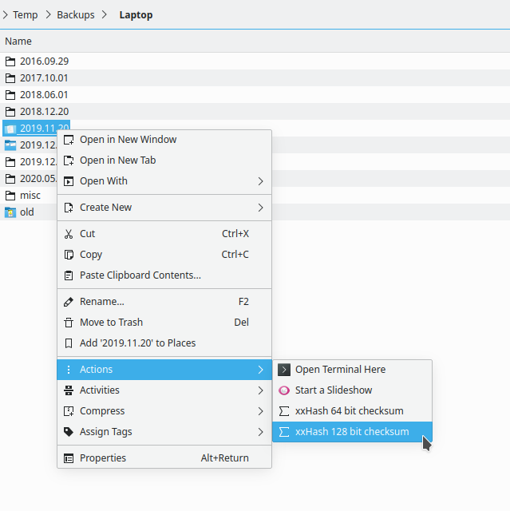

## Dolphin service menu: xxHash - extremely fast directory checksum / hash

Creates a file with checksums / hashes of all files in a directory using extremely fast xxHash algorithm.

**Supported languages:** Dutch, English, Russian  

Adding support for your language is very simple:

Just add `Name[xx]=…` translated entries for it in `.desktop` file and create a pull request :wink:  
To do so in GitHub web interface, you can edit file right there, then click `Propose changes` → `Create pull request`.

### Installation:
Place `.desktop` file in `~/.local/share/kio/servicemenus`

---

This project uses xxHash. Please, make sure <code>xxhash</code> package is installed.

See [SMhasher](https://rurban.github.io/smhasher) for comparison with other hash algorithms.

